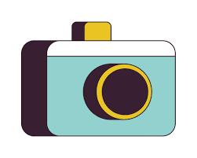
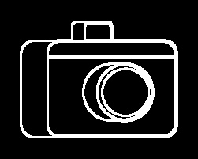

# Line Art Generator

This project converts an input image into a clean black-and-white line-art drawing using OpenCV and Python.

## Features
- **Converts Images to Line Art**: Generates a black-and-white sketch version of any input image.  
- **Adjustable Line Thickness**: Lines can be thicker or thinner based on a single parameter.  
- **Automatic Processing**: Takes an image from the assets folder and saves the result directly without user interaction.  
- **Clean and Clear Output**: Produces high-contrast line-art with a white background and visible black outlines.  

## Project Structure
```
Line-Art-Generator/
│
├── src/
│ ├── main.py          # Main script that controls processing
│ └── utils.py         # Helper functions for image operations
│
├── assets/            # Input images for processing
│ └── portrait1.jpg
| └── portrait2.jpg
| └── portrait3.jpg
│
├── results/           # Generated outputs
│ └── line_art1.jpg
│ └── line_art2.jpg
│ └── line_art3.jpg
│
├── requirements.txt   # Python dependencies
├── README.md          # Project documentation
└── .gitignore
```
## Installation

1. Clone the repository:
    ```bash
    git clone <repo-link>
    ```

2. Install the required dependencies:
    ```bash
    pip install -r requirements.txt
    ```

## Usage
Run the project from the root directory:
```bash
python src/main.py
```
The script will:
- Load the input image  
- Convert it to grayscale  
- Apply Canny edge detection  
- Increase thickness using dilation  
- Save the final output in `results\`

## How It Works
1. Convert the input image → **Grayscale**  
2. Apply **Edge Detection** using Canny  
3. Apply **Dilation** to thicken edges  
4. Save output → **Clean Line-Art Image**

## Output
The processed line-art image will be saved in the `results\` directory. (Each image corresponding to each input image in `assets\` directory)

## Sample Run

Example 1:

Input:\t\tOutput:

<p align="center">
   

  
</p>

Made by Jairaj R.
